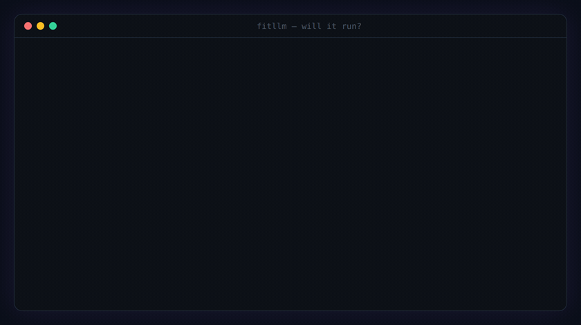

# FitLLM Engine

FitLLM is an open-source, zero-dependency engine that checks whether a local LLM fits on a GPU or Apple Silicon Mac using architecture-aware memory math.

[](https://www.npmjs.com/package/fitllm-engine)
[](vectors/fit-vectors-v1.json)
[](LICENSE)
[](package.json)



> **Live: https://fitllm.run · Bilingual  · Free · No ads · No login**
> 
> **Open engine:** [fitllm-engine](https://github.com/click6067-ship-it/fitllm-engine) (MIT · npm `fitllm-engine` · `npx fitllm`)
> 
> Zero dependencies. One readable file: [`engine.js`](engine.js). Conformance-vector tested. MIT.

## Remote MCP server

Connect any Streamable HTTP MCP client to `https://fitllm.run/api/mcp`:

```json
{
  "mcpServers": {
    "fitllm": {
      "url": "https://fitllm.run/api/mcp"
    }
  }
}
```

## Tools

- `check_llm_fit` — check one model against a GPU, multi-GPU rig, or Mac and return the verdict, memory breakdown, and a fix when it does not fit.
- `what_fits_on_hardware` — rank the supported local models that fit the given GPU, multi-GPU rig, or Mac.
- `list_supported` — list the built-in model and hardware names accepted by the fit checker.

The server is read-only, stateless, and requires no authentication.

```bash
npx fitllm "GLM-4.7-Flash" --gpu 4090     # ✓ FITS — 21.9/24 GB, free 2.1 GB
npx fitllm "gpt-oss-120b" --mac 64        # ✗ WON'T FIT → what to change to make it fit
npx fitllm "Qwen 3.6 35B" --gpu "5090 + 3090"   # multi-GPU rig — VRAM pools (56GB), even mixed cards
npx fitllm --top --detect                 # what CAN this machine run? — best quant per model
npx fitllm --detect                       # reads this machine's real hardware
```

**Why a CLI?** The "will it run?" question is born in the terminal — one line before `ollama pull`. No install, no tab-switching, and it reads your *actual* hardware with `--detect` instead of asking you to know your VRAM. Exit code 0/1 makes it a **pre-download guard**:

```bash
# in your model-pull script — stop BEFORE the 40 GB download:
npx fitllm "gpt-oss-120b" --detect || { echo "won't fit — aborting pull"; exit 1; }
```

This is the open calculation core of FitLLM. **The math is open so you can audit it.**

Ask an LLM "does Qwen 3.6 fit my GPU?" and it pattern-matches to an architecture from its training cutoff — and usually says *no*. Catalog-based calculators lag new releases. On the fitllm.run web calculator, pasting a Hugging Face ID reads that model's **official `config.json` live**, so supported architectures work on **day-one releases**; the built-in catalog (CLI/API/MCP) uses fields curated from pinned official configs and on the hybrid / sliding-window / MoE architectures that naive formulas get wrong.

Covers **Apple Silicon unified memory (M1–M5, Pro/Max/Ultra — up to the 512GB Mac Studio)**, **NVIDIA GPUs (RTX 20/30/40/50, workstation RTX 6000 Ada / RTX PRO 6000, datacenter A100/H100/H200/B200)**, **AMD Radeon (RX 7000/9000, PRO W7900)** and **multi-GPU presets (2×3090, 2×4090, 4×3090)** — with GGUF Q-tier weight quantization kept separate from KV-cache quantization. Every hardware number is cross-verified against **≥2 independent sources** (source URLs embedded per-value in `engine.js`).

---

## Why most LLM memory calculators are wrong

Almost every "can I run this LLM?" calculator estimates the KV cache with the textbook formula:

```
KV ≈ 2 × num_layers × num_kv_heads × head_dim × context_length × bytes
```

That assumes **every layer keeps a full-context KV cache with one uniform head shape.** True for Llama-1/2 — wrong for most 2025–2026 models:

| Model | What naive formulas miss | Naive KV | FitLLM KV | Off by |
|---|---|---|---|---|
| **Gemma 4 31B** @131K, 8-bit | 50 of 60 layers are sliding-window (keep only the last 1024 tokens); the 10 global layers use a different head shape (4 KV-heads × 512, not 16 × 256) | ~60 GB | ~5.4 GB | **11×** |
| **Qwen 3.6 27B** @131K, 8-bit | 48 of 64 layers are linear attention (Gated DeltaNet) — no growing KV cache | ~16 GB | ~4 GB | **4×** |
| **Qwen 3.8 27B** @256K, F16 KV | same shape, newest generation: KV lives on 16 of 64 layers only | 64.0 GiB | **16.0 GiB** | **4×** |
| **GLM-4.7-Flash** @128K, bf16 | MLA: K/V compressed into one shared latent (512+64 dims, cached once — not per-head K and V) | ~117 GB | ~6.6 GB | **17.8×** |
| Plain dense (Llama, Mistral…) | nothing — standard transformer | same | same | 1× ✅ |

An 11× error flips the verdict: a naive calculator says Gemma 4 31B *won't fit* in 64 GB at long context, when it **fits comfortably**.

### The five things they ignore
1. **Sliding-window attention** (Gemma 2/3/4, gpt-oss): most layers only keep the last *N* tokens, so their KV stops growing. Only the global layers scale with full context.
2. **Hybrid / linear attention** (Qwen 3.6 / 3.8, many 2026 models): linear-attention layers use a fixed-size recurrent state, not a growing KV cache. That state is modeled too, as its own component (`linearState`) — it is a constant per sequence, so it never inflates the context curve.
3. **MLA — Multi-head Latent Attention** (GLM-5.2, GLM-4.7-Flash, DeepSeek family): the cache is a single low-rank latent (`kv_lora_rank` + RoPE dims) shared across all heads — per-head "2 × heads × head_dim" formulas over-count by an order of magnitude. Verified against the DeepSeek-V2 paper (arXiv:2405.04434) and the official DeepSeek-V3 inference code.
4. **Heterogeneous head dims + MoE**: global layers can use a different `head_dim` (Gemma 4: 512 vs 256). MoE keeps every expert in memory while activating only a few per token.
5. **PLE — Per-Layer Embeddings** (Gemma 4 e2b/e4b): llama.cpp keeps the `per_layer_token_embd` tensor in **system RAM by default** regardless of `-ngl` (forcing it onto CUDA crashes for K-quant GGUFs; only non-K quants can opt in — ggml-org/llama.cpp#14430), so only the non-PLE weights need VRAM. Counting all 5.1B params against a GPU over-predicts e2b's resident weights by ~1.9× and flips small-card verdicts. On Apple Silicon system RAM *is* accelerator memory, so total params stay correct there. (Caveats: vLLM loads PLE fully onto the GPU — this engine's GPU math is anchored to the default GGUF/llama.cpp behavior its quant tiers come from; the residency measurements are from the E-series PLE stack, and a direct measurement on a Gemma 4 GGUF is welcome in issue #7.)

This engine models each layer type separately, verified against official HuggingFace `config.json` files.

---

## What it computes

```
Total = Parameters (quantization-adjusted)
      + KV cache (per layer kind: sliding / global / linear / dense)
      + Runtime overhead (quant metadata + KV block padding + activations + fixed)
      + macOS base (Apple Silicon unified memory)
```

Plus a `parseHfConfig()` that turns configs from verified, modeled Hugging Face architecture families into the model shape above; unsupported structures fail closed instead of returning a guess. (No token/s prediction — deliberately: speed depends on runtime/backend in ways a static model can't claim honestly. Fit is a verifiable claim; speed is not.)

## Usage

```js
import { simulate, LOCAL_MODELS, parseHfConfig } from './engine.js';

const model = LOCAL_MODELS.find((m) => m.name === 'Gemma 4 31b');
const sim = simulate(model, /*ram*/ 64, /*ctx*/ 131072, /*bits*/ 8);
// → { used, free, verdict: 'yes'|'tight'|'no', param, kv, rt, os, maxContext, ... }

// a config from a modeled Hugging Face architecture family:
const m = parseHfConfig('Qwen/Qwen3-32B', configJson, totalSizeBytes);
```

## Verification

- Architecture values checked against official HuggingFace `config.json`.
- Gemma 4 31B full-context KV reproduces **20.78 GiB**, matching the published [architecture analysis](https://kaitchup.substack.com/p/gemma-4-31b-and-26b-a4b-architecture). Reproduce it by hand:

```
global: 10 layers × 2(K,V) × 4 heads × 512 dim × 2 B × 262,144 = 21,474,836,480 B
local:  50 layers × 2(K,V) × 16 heads × 256 dim × 2 B × 1,024  =    838,860,800 B
total = 22,313,697,280 B ÷ 1024³ = 20.78 GiB
```

- Calibration: Qwen 3.6 35B-A3B @128K, 8-bit ≈ **54 GB** (matches real local runs).
- MLA per-token cost: GLM-4.7-Flash = (512 + 64) × 2 B × 47 layers = **54,144 B/token** — pinned by conformance vectors.

All figures are estimates — real usage varies with the runtime (MLX/Ollama/llama.cpp), OS state, and quantization scheme.

## Conformance vectors

[`vectors/fit-vectors-v1.json`](vectors/fit-vectors-v1.json) pins **16 language-neutral test vectors** (exact KV bytes, per-token costs, fit verdicts) derived by hand from official `config.json` values — e.g. *"Gemma 4 31B at 262,144 ctx, bf16 = exactly 22,313,697,280 bytes"*. **Any implementation in any language conforms if every vector passes** — run ours with `node vectors/run.mjs`.

**Why this matters:** the formulas are easy to copy; a verified answer key is not. If you port this engine to Python, Rust or Go, you don't become an untrusted fork — pass the vectors and you're a **conformant implementation of the same standard**. Port the engine, keep the vectors.

## The Fit Census — every model × every device, one truth table

[`census/`](census/README.md) holds **8,000+ verdicts** (24 models incl. draft tier × 88 GPUs/Macs × quant tiers) computed by this engine — as CSV/JSON you can import, chart or cite, plus a starter matrix ("biggest model that fits comfortably per device"). Regenerate it yourself: `npm run census`. Real-world measurements land next to predictions via [`fixtures/`](fixtures/README.md) PRs — **predicted vs. measured, in public.**

## Embed a fit badge

Show whether a model runs on given hardware — live from the engine, one line in any README or model card:

```markdown

```


Params: `model` (name, fuzzy), `gpu` (name, fuzzy) **or** `ram` (GB, Apple unified memory), optional `quant` (GGUF tier / 4|8|16), `ctx`, `kv`. Verdict color: green fits · yellow tight · red won't fit.

**Why embed it?** The #1 question under every model card and local-AI tutorial is *"will it run on my machine?"* The badge answers it **live from the engine** — recomputed when the data updates, not a stale claim frozen into your README. If you publish models or write guides: one line replaces a whole FAQ paragraph and cuts the "it OOM'd on my 8GB card" issues before they're filed.

## Ask your AI assistant (MCP)

The engine runs as a public **MCP server** at `https://fitllm.run/api/mcp` — connect it once and your assistant answers *"can I run X on my Y?"* with this engine's math instead of guessing from stale training data (LLMs routinely get KV-cache math wrong — see the 17.8× table above).

- **Claude** (web / desktop / mobile): Settings → Connectors → **Add custom connector** → paste `https://fitllm.run/api/mcp`
- **Claude Code**: `claude mcp add --transport http fitllm https://fitllm.run/api/mcp`
- **Cursor / Windsurf**: add to `mcp.json` → `{ "mcpServers": { "fitllm": { "url": "https://fitllm.run/api/mcp" } } }`
- **ChatGPT**: Settings → Apps → Advanced → Developer mode → add MCP server (Plus/Pro)

Tools: `check_llm_fit` (verdict + full memory breakdown + fix suggestion — supports multi-GPU rigs like `"RTX 5090 + RTX 3090"`), `what_fits_on_hardware` (ranked list for your machine), `list_supported`. Resources: `fitllm://models`, `fitllm://hardware`, `fitllm://census`, `fitllm://engine`. **Intentionally open**: read-only, stateless, no auth, no secrets — every call is a pure function of public data.

Listed on: [official MCP registry](https://registry.modelcontextprotocol.io) (`run.fitllm/fitllm`) · [Glama](https://glama.ai/mcp/connectors/run.fitllm/fitllm) · [mcp.so](https://mcp.so/servers/fitllm) · [Smithery](https://smithery.ai/server/click6067/fitllm)

## For agents & scripts — plain HTTP API

No MCP client? One GET, no auth, no key — JSON by default, plain text for curl:

```bash
curl 'https://fitllm.run/api/check?model=gemma%204%2031b&gpu=4090'
# multi-GPU rigs: gpu=5090%2B3090 · Mac: ram=64 · usage: curl https://fitllm.run/api/check
```

Open data: the full **Fit Census** (8,000+ verdicts, **CC0**) at [fitllm.run/data](https://fitllm.run/data) and on [Hugging Face Datasets](https://huggingface.co/datasets/click6067/fitllm-fit-census). Try the engine in-browser: [HF Space demo](https://huggingface.co/spaces/click6067/fitllm).

## Principles

**No ads. No login. No affiliate links. Output is never for sale.** Fit is a *winnable*, verifiable claim; raw tok/s is not — so this engine refuses speed predictions rather than dress a guess as precision.

## Help calibrate

Ran a model and measured real peak memory? **[Report a measurement](../../issues/new?labels=measurement)** — it improves the estimates for everyone.

## Built by

[yongha](https://yonghakim.com) — [GitHub](https://github.com/click6067-ship-it). Powers [fitllm.run](https://fitllm.run).

## License

MIT © click6067-ship-it
